# 👋 Hi, I'm Shaoqing Dai

**GIS & Environmental Data Scientist · Spatial Health · Remote Sensing · Environmental Geography**

I am a researcher working at the intersection of **Geographic Information Science (GIS), spatial data science, remote sensing, environmental change, and human health**.

My research focuses on developing geospatial methods and computational approaches to understand how **places, environments, and environmental processes shape human and ecosystem health**.

  
  
  
  

---

## 🔬 Research Interests

* 🌍 **Geographic Information Science & Spatial Data Science**
* 🛰️ **Remote Sensing & Earth Observation**
* 🏙️ **Urban Environment & Health Geography**
* 🫀 **Spatial Lifecourse Health & Environmental Exposure**
* 🌱 **Soil Ecology & Environmental Biogeochemistry**
* 🌳 **Forest Carbon Cycling & Global Change**
* 🤖 **Machine Learning & Geospatial Artificial Intelligence**
* 🗺️ **Spatiotemporal Modeling & Environmental Mapping**

---

## 🧑‍🔬 About Me

I received my **Ph.D. in Earth Observation Science** from the Faculty of Geo-Information Science and Earth Observation (ITC), University of Twente, Netherlands.

My earlier training was in **Geographical Sciences, GIS, and geospatial engineering**, and my research has progressively expanded from urban and health geography toward environmental processes, remote sensing, and carbon cycling.

I am particularly interested in connecting **multi-source geospatial observations with process-based environmental understanding**.

My current work explores how spatial and temporal data can be integrated to reveal hidden environmental dynamics—from **urban exposure and human health** to **carbon cycling and ecosystem responses to global change**.

---

## 🚀 Research Themes

### 🏙️ Urban Environment & Health

* Built environment and physical activity
* Walkability and bikeability
* Food environment and obesity
* Street-level environmental exposure
* PM₂.₅ mapping and environmental epidemiology
* Spatial lifecourse health

### 🛰️ Earth Observation & Geospatial AI

* Satellite remote sensing
* Street View imagery
* Multi-source geospatial data fusion
* Machine learning for environmental mapping
* Spatiotemporal modeling
* GeoAI and computational geography

### 🌱 Cabron cycling

* Soil organic carbon dynamics
* Forest carbon cycling
* Carbon dioxide mapping

---

## 🛠️ Tools & Technologies

  

**Geospatial & Remote Sensing**

`ArcGIS` · `QGIS` · `Google Earth Engine` · `GDAL` · `Rasterio` · `GeoPandas`

**Data Science & Modeling**

`Python` · `R` · `PyTorch` · `Random Forest` · `Machine Learning` · `Spatial Statistics`

**Visualization & Design**

`Matplotlib` · `D3.js` · `Tableau` · `Adobe Illustrator` · `Adobe InDesign`

**Scientific Computing**

`Linux` · `Bash` · `Docker` · `LaTeX`

---

## 📚 Selected Research Projects

### 🫀 Spatial Health & Obesogenic Environments

Developing geospatial approaches to characterize the relationship between **urban environments, environmental exposures, physical activity, and obesity** using multi-source spatial data.

**Methods:**
`Street View Images` · `POI` · `GPS trajectories` · `Remote Sensing` · `Machine Learning` · `Spatial Analysis`

---

### 🌫️ Street-level PM₂.₅ Mapping

Developing high-resolution spatiotemporal models for estimating **street-level PM₂.₅ concentrations** by integrating environmental, meteorological, satellite, and urban geospatial data.

**Methods:**
`Ensemble Random Forest` · `Land Use Regression` · `Remote Sensing` · `Spatiotemporal Modeling`

---

### 🏙️ Urban Environment, Carbon & Sustainability

Investigating **urban environmental dynamics and sustainability** through geospatial data, remote sensing, and spatial modeling, with a particular interest in how **urbanization, land cover, human activities, and environmental processes** interact across space and time.

**Focus:**
`Urban Carbon Cycle` · `Urban Environment` · `Remote Sensing` · `Land Cover` · `Urban Climate` · `Spatial Modeling` · `Sustainable Cities`

---

## 🌍 Open Source & Geospatial Community

I am interested in developing and contributing to open-source tools for **GIS, spatial statistics, geospatial data science, and environmental modeling**.

Contributions and collaborations include work related to:

* **GeoDa Center**
* **rgeoda**
* **libgeoda**
* **AI 4D City**
* **Spatial Lifecourse Health**
* **Sustainable Cities & Mobility**

---

## 📊 GitHub Stats

  
  

---

## 📌 Featured Repositories

Some of my repositories explore topics including:

* 🗺️ Urban GIS & spatial analysis
* 🌍 Geospatial data science
* 🛰️ Remote sensing
* 🤖 Machine learning
* 📊 R / Python spatial analysis
* 🏙️ Urban environment and health

👉 Explore all repositories on my **[GitHub profile](https://github.com/GISerDaiShaoqing)**.

---

## 🌐 Find Me

| Platform             | Link                                                                |
| -------------------- | ------------------------------------------------------------------- |
| 🌐 Personal Homepage | [gisersqdai.top](https://gisersqdai.top/mycv/)                      |
| 💻 GitHub            | [GISerDaiShaoqing](https://github.com/GISerDaiShaoqing)             |
| 🔗 LinkedIn          | [Shaoqing Dai](https://www.linkedin.com/in/shaoqing-dai-2ab7b6182/) |
| 𝕏 X / Twitter       | [@DaiShaoqing](https://twitter.com/DaiShaoqing)                     |
| 📧 Email             | [dsq1993qingge@163.com](mailto:dsq1993qingge@163.com)               |

---

  

  <i>Exploring places, environments, and health through geospatial data.</i>

